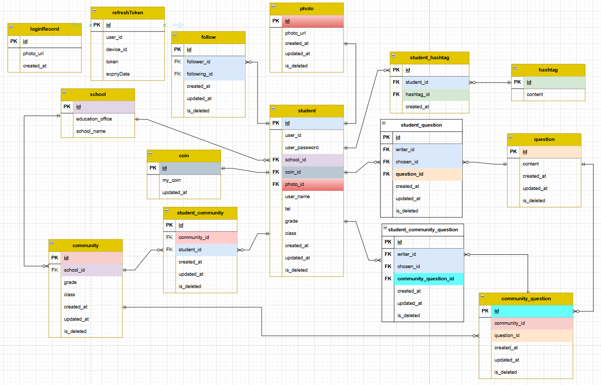

# PEEP

## 익명 질문 SNS
미국 청소년 사이에서 큰 인기를 끌었던 GAS라는 익명 질문 SNS를 모방하여 만든 SNS

## 주요 기능

* 회원 가입, 로그인, 로그아웃
  * accessToken refresh 기능
  * redis 활용한 blackList 토큰 관리
  * 로그인 기록 관리
* 팔로우, 언팔로우 기능
* 질문에 상대 지목하기
  * 학교별 공통질문
    * 같은 학교의 학생들이 공통으로 받는 질문으로 학교내의 사람을 지목 가능
  * 랜덤 공통질문
    * 개인마다 다른 종류의 질문이 주어지고 자신의 팔로잉 상대 중 지목 가능
* 힌트 받기
  * 질문에 지목 받은 사람은 누가 지목했는지 힌트를 얻을 수 있다.
  * 힌트 종류: 성별, 나이, 학교, 초성, 해시태그
  

## ERD 이미지

## 개발 인원: 4명

| 이름  |   설명    |
|:----|:-------:|
| 박인서 | 기획, ios |
| 서민지 | 기획, FE  |
| 신지훈 | 기획, BE  |
| 유수민 | 기획, 디자인 |

## 계획
* 알람 기능 추가
* 질문 생성시 방대한 많은 데이터가 만들어지기 때문에 Spring Batch 도입 고려

## 스택

